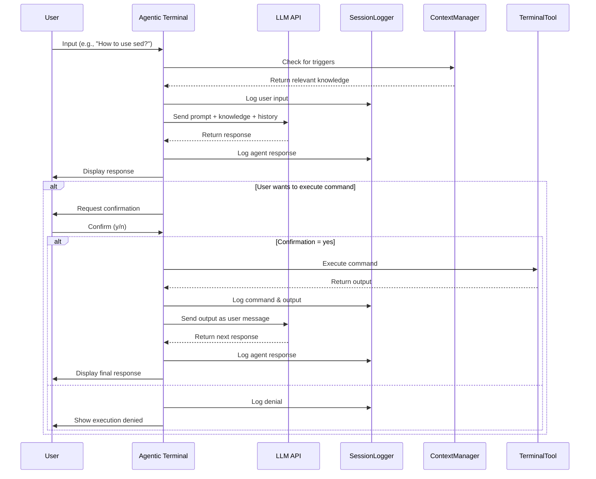
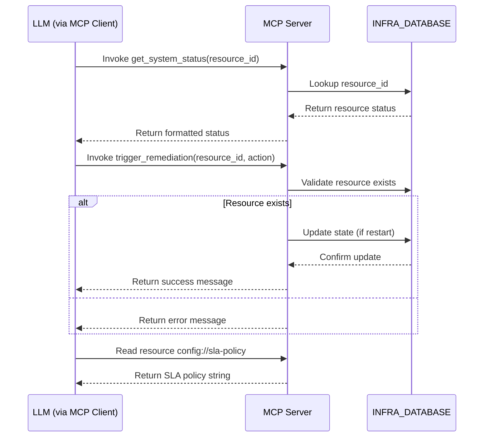

# Software Architecture Diagram and Notes

## High-Level Architecture (C4 Model)

### Context Diagram
```
┌─────────────────┐    ┌────────────────────────────┐
│                 │    │                            │
│   Human User    │◄───┤  Agentic Terminal (main.py)│
│                 │    │                            │
└─────────────────┘    └─────────────┬──────────────┘
                                      │
                                      ▼
                            ┌────────────────────┐
                            │                    │
                            │     LLM API        │
                            │  (Local/Remote)    │
                            │                    │
                            └────────────────────┘
```

### Container Diagram
```
┌─────────────────┐    ┌────────────────────────────┐    ┌────────────────────┐
│                 │    │                            │    │                    │
│   Human User    │◄───┤  Agentic Terminal (main.py)│◄───┤  MCP Server        │
│                 │    │                            │    │  (mcp_self_healing_│
└─────────────────┘    └─────────────┬──────────────┘    │   server.py)       │
                                      │                   │                    │
                                      ▼                   │                    │
                            ┌────────────────────┐       │                    │
                            │                    │       │                    │
                            │     LLM API        │◄──────┘                    │
                            │  (Local/Remote)    │                          │
                            │                    │                          │
                            └────────────────────┘                          │
                                      │                                     │
                                      ▼                                     │
                            ┌────────────────────┐                         │
                            │                    │                         │
                            │  Knowledge Base    │                         │
                            │  (in main.py)      │                         │
                            │                    │                         │
                            └────────────────────┘                         │
                                      │                                     │
                                      ▼                                     │
                            ┌────────────────────┐                         │
                            │                    │                         │
                            │   Session Logs     │                         │
                            │    (logs/)         │                         │
                            │                    │                         │
                            └────────────────────┘                         │
                                      │                                     │
                                      ▼                                     │
                            ┌────────────────────┐                         │
                            │                    │                         │
                            │ TerminalTool       │                         │
                            │  (subprocess)      │                         │
                            │                    │                         │
                            └────────────────────┘                         │
                                      │                                     │
                                      ▼                                     │
                            ┌────────────────────┐                         │
                            │                    │                         │
                            │   System Shell     │                         │
                            │                    │                         │
                            └────────────────────┘                         │
```
### Component Diagram (MCP Server)
```
┌─────────────────────────────────┐
│                                 │
│   MCP Server                    │
│   (mcp_self_healing_server.py)  │
│                                 │
│  ┌──────────────┐  ┌──────────────┐
│  │              │  │              │
│  │  MCP Tools   │  │ MCP Resources│
│  │  (get_system_│  │  (config://  │
│  │   status,    │  │   sla-policy)│
│  │   trigger_   │  │              │
│  │   remediation)│  │              │
│  │              │  │              │
│  └──────────────┘  └──────────────┘
│                                 │
│  ┌────────────────────────────┐ │
│  │                            │ │
│  │  INFRA_DATABASE (State)    │ │
│  │  (web-server-01,           │ │
│  │   db-cluster-01,           │ │
│  │   cache-node-01)           │ │
│  │                            │ │
│  └────────────────────────────┘ │
│                                 │
└─────────────────────────────────┘
```

## Component Interaction Flowcharts

### Agentic Terminal Interaction Flow


### MCP Server Interaction Flow


## Data Flow and Dependency Graphs

### Data Flow in Agentic Terminal
```
User Input
    ↓
[Context Manager] ← Knowledge Base
    ↓
[System Prompt Builder] ← Base Prompt + Knowledge
    ↓
[LLM API] ← Messages (System + History + User)
    ↓
[Response Parser] ← LLM Output
    ↓
{Response Display, Command Extraction}
    ↓
[Terminal Executor] ← Command (if EXEC found)
    ↓
[Output Logger] ← Command Results
    ↓
[Conversation History] ← User/Agent Messages
    ↓
[Next Iteration]
```

### Dependency Graph
```
main.py
├── dependencies: os, re, json, requests, subprocess, sys, datetime, typing
├── internal: SessionLogger, TerminalTool, ContextManager, AgentLLM
└── external: LLM API (configurable)

mcp_self_healing_server.py
├── dependencies: asyncio, typing, mcp.server.fastmcp
├── internal: INFRA_DATABASE (simulated state)
└── external: None (self-contained simulation)
```

## Infrastructure Overview

### Current Implementation (Simulation)
- **State Storage**: In-memory Python dictionary (`INFRA_DATABASE`)
- **Resources Simulated**:
  - web-server-01: Healthy, low CPU/memory usage
  - db-cluster-01: Degraded, high CPU/memory usage (demonstrates remediation need)
  - cache-node-01: Healthy, minimal resource usage
- **Actions Supported**:
  - `restart`: Resets resource to healthy state with baseline metrics
  - `scale_up`: Simulates sending signal to cloud provider
  - `flush_cache`: Placeholder action (pending verification)

### Production Infrastructure Considerations
For deployment in real environments, this architecture would need to:

1. **Replace Simulated State** with real infrastructure connectors:
   - Kubernetes API for pod/container management
   - Cloud provider APIs (AWS EC2, GCP Compute Engine, Azure VMs)
   - Configuration management tools (Ansible, Terraform, Puppet)
   - Monitoring system APIs (Prometheus, Datadog, CloudWatch)

2. **Add Authentication & Authorization**:
   - MCP request validation
   - Infrastructure API credentials management
   - Role-based access control for different action types

3. **Implement Persistent Storage**:
   - Database for infrastructure state history
   - Audit logging for all actions performed
   - Configuration persistence for MCP server settings

4. **Enhance Observability**:
   - Metrics collection (request latency, action success rates)
   - Distributed tracing for complex remediation workflows
   - Health check endpoints for orchestration systems

5. **Improve Reliability**:
   - Circuit breaker patterns for infrastructure API calls
   - Retry mechanisms with exponential backoff
   - Graceful degradation when infrastructure components unavailable

## Justification for Major Architectural Choices

### Modular Separation of Concerns
**Choice**: Separated agentic terminal (`main.py`) from infrastructure MCP server (`mcp_self_healing_server.py`)
**Justification**:
- Allows independent development and scaling of agent capabilities vs. infrastructure integration
- Enables reuse of MCP server with different agent interfaces
- Simplifies testing and maintenance of each component
- Follows Unix philosophy of "do one thing and do it well"

### Tool-Calling Pattern for LLM Integration
**Choice**: Using MCP's standardized tool/resource pattern instead of custom API endpoints
**Justification**:
- Provides interoperability with any MCP-compatible LLM/client
- Standardizes how LLMs discover and invoke capabilities
- Reduces integration complexity through well-defined protocol
- Leverages growing MCP ecosystem and tooling

### Progressive Knowledge Disclosure
**Choice**: Contextual knowledge injection based on trigger keywords rather than always-included context
**Justification**:
- Prevents context window overflow in LLMs with limited capacity
- Reduces token usage and associated costs
- Increases relevance of provided knowledge to current task
- Maintains focused, coherent responses from the LLM

### Safety-First Terminal Execution
**Choice**: Input validation, command blocking, and user confirmation requirements
**Justification**:
- Prevents accidental or malicious system damage
- Maintains human oversight for potentially dangerous operations
- Provides audit trail for all executed commands
- Balances automation benefits with risk mitigation

### Simulated Infrastructure State
**Choice**: Using in-memory dictionary for infrastructure state rather than real APIs
**Justification**:
- Enables demonstration and testing without infrastructure dependencies
- Simplifies initial development and debugging
- Provides predictable, deterministic behavior for learning
- Clearly marked as simulation with path to real integration

### STDIO Transport for MCP Server
**Choice**: Using standard input/output for MCP communication
**Justification**:
- Simple to implement and debug
- Works well with local LLM applications (like Claude Desktop)
- Avoids network complexity for local development
- Easy to containerize and deploy in various environments