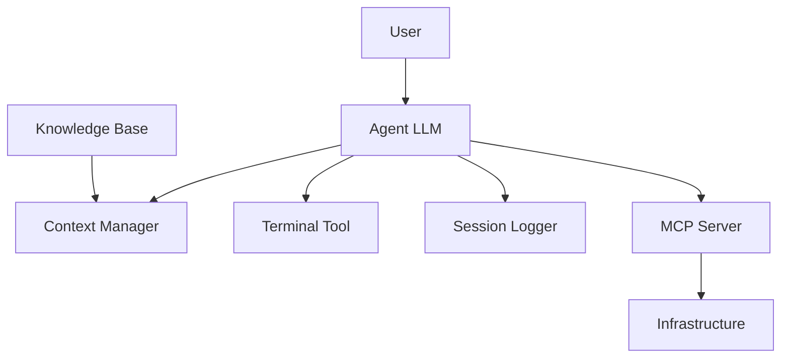

# OSAgent Architecture

## Component Diagram (Mermaid)

## Layered Architecture Overview
1. **Presentation Layer**: User interacts via CLI (main.py)
2. **Application Layer**: Agent orchestrator (AgentLLM, ContextManager)
3. **Tool Layer**: TerminalTool, SessionLogger
4. **Integration Layer**: MCP Server (mcp_self_healing_server.py)
5. **Infrastructure Layer**: Simulated infrastructure (INFRA_DATABASE)

## Key Design Patterns
- **Singleton**: MCP server instance
- **Factory**: Tool creation (TerminalTool, SessionLogger)
- **Observer**: Logging system captures all interactions
- **Strategy**: ContextManager selects relevant knowledge base entries

## Critical Dependencies/External Services
- MCP (Model Context Protocol) server via `mcp.server.fastmcp`
- Local LLM API endpoint (http://localhost:1234/v1/chat/completions)
- Subprocess for terminal command execution
- Requests library for LLM communication

## Entry Points and Major APIs
- **main.py**: `run_agentic_session()` - CLI entry point
- **mcp_self_healing_server.py**: 
  - `get_system_status(resource_id)` - MCP tool for health queries
  - `trigger_remediation(resource_id, action)` - MCP tool for remediation
  - `get_sla_policy()` - MCP resource for SLA context